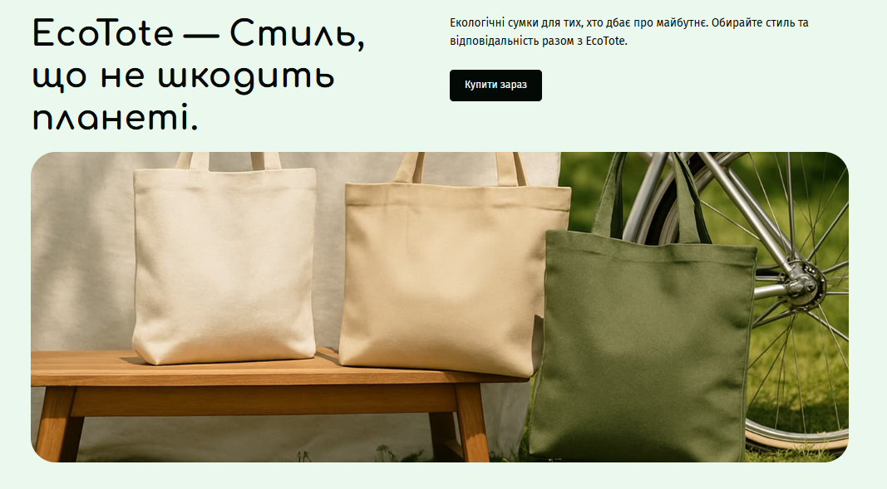

# EcoTote 🌿

**Style that doesn't harm the planet.**

Eco-friendly bags for those who care about the future. Choose style and responsibility together with EcoTote.

## 🔗 Live Demo

https://liska-iriska.github.io/ecotote/

## 📋 Project Overview

EcoTote is a responsive landing page built for an eco-friendly bag brand, promoting sustainable style and environmental responsibility. The project was developed by an 9-member team as a collaborative front-end exercise, focusing on clean semantic markup, pixel-accurate layout, and full responsiveness across all device sizes.

## ✨ Features

- Fully responsive design — optimized for Mobile, Tablet, and Desktop screens
- Semantic, accessible HTML5 structure
- Clean, modern UI aligned with brand identity
- Cross-browser compatible layout
- BEM-based CSS architecture for maintainability

## 🛠️ Built With

- **HTML5** — semantic markup
- **CSS3** — Flexbox / Grid, media queries for responsive design


## 🚀 Getting Started

Clone the repository:

```bash
git clone https://github.com/Liska-iriska/ecotote.git
cd ecotote
code .
```

Then simply open `index.html` in your browser of choice.

## 📸 Screenshots



## 📄 License

This project was created for educational purposes.
